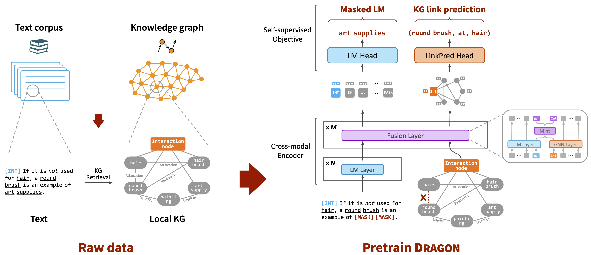

# DRAGON: Deep Bidirectional Language-Knowledge Graph Pretraining

This repo provides the source code & data of our paper "[DRAGON: Deep Bidirectional Language-Knowledge Graph Pretraining](https://arxiv.org/abs/2210.09338)" (NeurIPS 2022).


### Overview
DRAGON is a new foundation model (improvement of BERT) that is **pre-trained jointly from text and knowledge graphs** for improved language, knowledge and reasoning capabilities. Specifically, it was trained with two simultaneous self-supervised objectives, language modeling and link prediction, that encourage deep bidirectional reasoning over text and knowledge graphs.

DRAGON can be used as a drop-in replacement for BERT. It achieves better performance in various NLP tasks, and is particularly effective for **knowledge and reasoning-intensive** tasks such as multi-step reasoning and low-resource QA.

<p align="center">
  
</p>


## 0. Dependencies

Run the following commands to create a conda environment:
```bash
conda create -y -n dragon python=3.8
conda activate dragon
pip install torch==1.10.1+cu113 torchvision -f https://download.pytorch.org/whl/cu113/torch_stable.html
pip install transformers==4.9.1 wandb nltk spacy==2.1.6
python -m spacy download en
pip install scispacy==0.3.0
pip install https://s3-us-west-2.amazonaws.com/ai2-s2-scispacy/releases/v0.3.0/en_core_sci_sm-0.3.0.tar.gz
pip install torch-scatter==2.0.9 torch-sparse==0.6.12 torch-geometric==2.0.0 -f https://pytorch-geometric.com/whl/torch-1.10.1+cu113.html
```

## 1. Download pretrained models
You can download pretrained DRAGON models below. Place the downloaded model files under `./models`

| Model | Domain | Size | Pretraining Text | Pretraining Knowledge Graph | Download Link |
| ------------- | ------------- | --------- | ---- | ---- | ---- |
| DRAGON   | General     | 360M parameters | BookCorpus | ConceptNet | [general_model](https://nlp.stanford.edu/projects/myasu/DRAGON/models/general_model.pt) |
| DRAGON   | Biomedicine | 360M parameters | PubMed | UMLS | [biomed_model](https://nlp.stanford.edu/projects/myasu/DRAGON/models/biomed_model.pt) |


## 2. Download data
### Commonsense domain
You can download all the preprocessed data from [**[here]**](https://nlp.stanford.edu/projects/myasu/DRAGON/data_preprocessed.zip). This includes the ConceptNet knowledge graph as well as CommonsenseQA, OpenBookQA and RiddleSense datasets. Specifically, run:
```
wget https://nlp.stanford.edu/projects/myasu/DRAGON/data_preprocessed.zip
unzip data_preprocessed.zip
mv data_preprocessed data
```


**(Optional)** If you would like to preprocess the raw data from scratch, you can download the raw data – ConceptNet Knowledge graph, CommonsenseQA, OpenBookQA – by:
```
./download_raw_data.sh
```
To preprocess the raw data, run:
```
CUDA_VISIBLE_DEVICES=0 python preprocess.py -p <num_processes> --run common csqa obqa
```
You can specify the GPU you want to use in the beginning of the command `CUDA_VISIBLE_DEVICES=...`. The script will:
* Setup ConceptNet (e.g., extract English relations from ConceptNet, merge the original 42 relation types into 17 types)
* Convert the QA datasets into .jsonl files (e.g., stored in `data/csqa/statement/`)
* Identify all mentioned concepts in the questions and answers
* Extract subgraphs for each q-a pair


### Biomedical domain
You can download all the preprocessed data from [**[here]**](https://nlp.stanford.edu/projects/myasu/DRAGON/data_preprocessed.zip). This includes the UMLS biomedical knowledge graph and MedQA dataset.

**(Optional)** If you would like to preprocess MedQA from scratch, follow `utils_biomed/preprocess_medqa.ipynb` and then run
```
CUDA_VISIBLE_DEVICES=0 python preprocess.py -p <num_processes> --run medqa
```

<br>
The resulting file structure should look like this:

```plain
.
├── README.md
├── models/
    ├── general_model.pt
    ├── biomed_model.pt

└── data/
    ├── cpnet/                 (preprocessed ConceptNet KG)
    └── csqa/
        ├── train_rand_split.jsonl
        ├── dev_rand_split.jsonl
        ├── test_rand_split_no_answers.jsonl
        ├── statement/             (converted statements)
        ├── grounded/              (grounded entities)
        ├── graphs/                (extracted subgraphs)
        ├── ...
    ├── obqa/
    ├── umls/                  (preprocessed UMLS KG)
    └── medqa/
```

## 3. Train DRAGON
To train DRAGON on CommonsenseQA, OpenBookQA, RiddleSense, MedQA, run:
```
scripts/run_train__csqa.sh
scripts/run_train__obqa.sh
scripts/run_train__riddle.sh
scripts/run_train__medqa.sh
```


**(Optional)** If you would like to pretrain DRAGON (i.e. self-supervised pretraining), run
```
scripts/run_pretrain.sh
```
As a quick demo, this script uses sentences from CommonsenseQA as training data.
If you wish to use a larger, general corpus like BookCorpus, follow Section 5 (Use your own dataset) to prepare the training data.


## 4. Evaluate trained models
For CommonsenseQA, OpenBookQA, RiddleSense, MedQA, run:
```
scripts/eval_dragon__csqa.sh
scripts/eval_dragon__obqa.sh
scripts/eval_dragon__riddle.sh
scripts/eval_dragon__medqa.sh
```
You can download trained model checkpoints in the next section.


### Trained model examples
CommonsenseQA
<table>
  <tr>
    <th>Trained model</th>
    <th>In-house Dev acc.</th>
    <th>In-house Test acc.</th>
  </tr>
  <tr>
    <th>DRAGON <a href="https://nlp.stanford.edu/projects/myasu/DRAGON/models/csqa_model.pt">[link]</a></th>
    <th>0.7928</th>
    <th>0.7615</th>
  </tr>
</table>

OpenBookQA
<table>
  <tr>
    <th>Trained model</th>
    <th>Dev acc.</th>
    <th>Test acc.</th>
  </tr>
  <tr>
    <th>DRAGON <a href="https://nlp.stanford.edu/projects/myasu/DRAGON/models/obqa_model.pt">[link]</a></th>
    <th>0.7080</th>
    <th>0.7280</th>
  </tr>
</table>

RiddleSense
<table>
  <tr>
    <th>Trained model</th>
    <th>In-house Dev acc.</th>
    <th>In-house Test acc.</th>
  </tr>
  <tr>
    <th>DRAGON <a href="https://nlp.stanford.edu/projects/myasu/DRAGON/models/riddle_model.pt">[link]</a></th>
    <th>0.6869</th>
    <th>0.7157</th>
  </tr>
</table>

MedQA
<table>
  <tr>
    <th>Trained model</th>
    <th>Dev acc.</th>
    <th>Test acc.</th>
  </tr>
  <tr>
    <th><a href="https://github.com/michiyasunaga/LinkBERT">BioLinkBERT</a> + DRAGON <a href="https://nlp.stanford.edu/projects/myasu/DRAGON/models/medqa_model.pt">[link]</a></th>
    <th>0.4308</th>
    <th>0.4768</th>
  </tr>
</table>

**Note**: The models were trained and tested with HuggingFace transformers==4.9.1.


## 5. Use your own dataset
- Convert your dataset to  `{train,dev,test}.statement.jsonl`  in .jsonl format (see `data/csqa/statement/train.statement.jsonl`)
- Create a directory in `data/{yourdataset}/` to store the .jsonl files
- Modify `preprocess.py` and perform subgraph extraction for your data
- Modify `utils/parser_utils.py` to support your own dataset


## Citation
If you find our work helpful, please cite the following:
```bib
@InProceedings{yasunaga2022dragon,
  author =  {Michihiro Yasunaga and Antoine Bosselut and Hongyu Ren and Xikun Zhang and Christopher D. Manning and Percy Liang and Jure Leskovec},
  title =   {Deep Bidirectional Language-Knowledge Graph Pretraining},
  year =    {2022},  
  booktitle = {Neural Information Processing Systems (NeurIPS)},  
}
```

## Acknowledgment
This repo is built upon the following works:
```
GreaseLM: Graph REASoning Enhanced Language Models for Question Answering
https://github.com/snap-stanford/GreaseLM

QA-GNN: Question Answering using Language Models and Knowledge Graphs
https://github.com/michiyasunaga/qagnn
```
